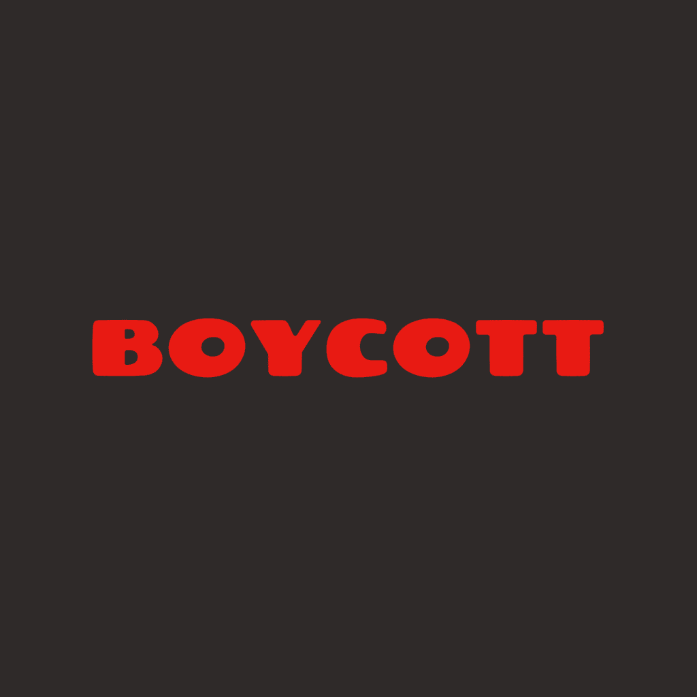

# 
# Gaza Boycott Helper

## Overview
Gaza Boycott Helper is a web application designed to help consumers make informed decisions about the products they purchase. The application allows users to identify companies that support violence in Gaza and provides alternatives to their products. By scanning product images or searching for company names, users can quickly determine if a product is from a company that should be boycotted.

## Purpose
This project aims to:
- Raise awareness about companies that directly or indirectly support violence in Gaza
- Empower consumers to make ethical purchasing decisions
- Provide a simple, accessible tool for identifying boycott-worthy products
- Offer alternatives to products from companies that support violence

## Features
- **Image Recognition**: Upload product images to identify companies
- **Real-time Analysis**: Get immediate feedback on scanned products
- **Company Database**: Comprehensive list of companies supporting violence in Gaza
 **Company Database**: Comprehensive list of companies supporting violence in Gaza *(coming soon)*
- **Product Alternatives**: Suggestions for ethical alternatives to boycotted products
- **Educational Resources**: Information about why specific companies are listed

## How It Works
1. Upload an image of a product through the web interface
2. The application analyzes the image using AI to identify the product and company
3. If the company is in our boycott database, you'll receive information about why they're listed
4. The application may suggest alternative products from ethical companies

## How Alternatives Work
Alternative products are collected directly from user photo submissions. When a user uploads an image and the identified product is **not** from a boycotted company, the application saves this product as a potential alternative for that user's country or location. Over time, this crowdsourced approach helps build a list of ethical alternatives that are relevant and available in different regions. These alternatives are then suggested to other users looking for options besides boycotted products.

```markdown
## Technical Implementation
- Django web framework
- WebSocket for real-time communication
- Image processing capabilities
- Database of boycott-worthy companies and their products
- React Native mobile app with TypeScript
  - Cross-platform support for iOS and Android
  - Native camera integration for product scanning
  - Real-time sync with Django backend
```
## Contributing
We welcome contributions to expand our database of companies and products. If you have information about companies supporting violence in Gaza that should be added to our database, please submit a pull request or open an issue.

## Disclaimer
This tool is created for educational and informational purposes. The decision to boycott any company or product is a personal choice. We encourage users to conduct their own research and make informed decisions based on their values and principles.

## License
[Your chosen license]
```markdown
MIT License

Copyright (c) 2024

Permission is hereby granted, free of charge, to any person obtaining a copy
of this software and associated documentation files (the "Software"), to deal
in the Software without restriction, including without limitation the rights
to use, copy, modify, merge, publish, distribute, sublicense, and/or sell
copies of the Software, and to permit persons to whom the Software is
furnished to do so, subject to the following conditions:

The above copyright notice and this permission notice shall be included in all
copies or substantial portions of the Software.

THE SOFTWARE IS PROVIDED "AS IS", WITHOUT WARRANTY OF ANY KIND, EXPRESS OR
IMPLIED, INCLUDING BUT NOT LIMITED TO THE WARRANTIES OF MERCHANTABILITY,
FITNESS FOR A PARTICULAR PURPOSE AND NONINFRINGEMENT. IN NO EVENT SHALL THE
AUTHORS OR COPYRIGHT HOLDERS BE LIABLE FOR ANY CLAIM, DAMAGES OR OTHER
LIABILITY, WHETHER IN AN ACTION OF CONTRACT, TORT OR OTHERWISE, ARISING FROM,
OUT OF OR IN CONNECTION WITH THE SOFTWARE OR THE USE OR OTHER DEALINGS IN THE
SOFTWARE.
```
## Contact

For questions or suggestions, you can reach us on [WhatsApp](https://wa.me/967770026665).
---

*Stand for justice. Make informed consumer choices.*